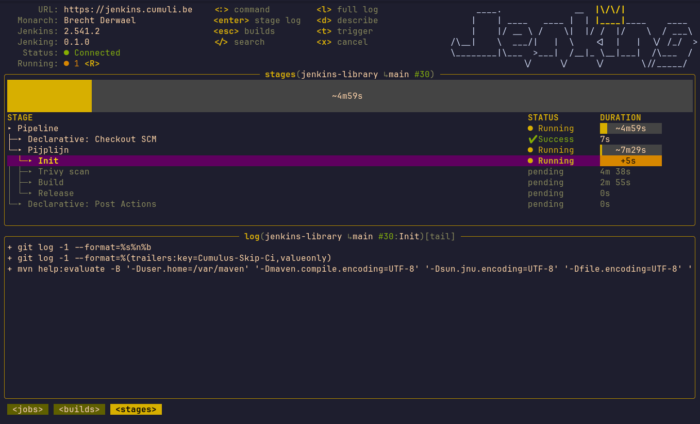

# Jenking

[](https://github.com/Breina/Jenking/releases/latest)

A terminal UI for Jenkins, inspired by [k9s](https://k9scli.io). Navigate jobs, monitor builds, and tail logs — without leaving your terminal.

> **Alpha:** Core functionality works. Expect rough edges. Feedback welcome via [GitHub Issues](../../issues).



---

## Features

- Browse jobs and folders
- View build history per job and branch
- Live log streaming
- Pipeline stage view with per-stage logs
- Test report summary
- Trigger builds with parameters
- Colorblindness filter (deuteranopia, protanopia, tritanopia, achromatopsia)
- Multiple themes

---

## Requirements

- A Jenkins instance with API access
- A Jenkins API token (not your password)

---

## Installation

### Pre-built binary (recommended)

**Linux (amd64):**
```sh
curl -Lo jenking.tar.gz https://github.com/Breina/Jenking/releases/latest/download/jenking_linux_amd64.tar.gz
tar -xf jenking.tar.gz jenking && rm jenking.tar.gz
chmod u+x jenking && sudo mv jenking /usr/local/bin/
```

**macOS (Apple Silicon):**
```sh
curl -Lo jenking.tar.gz https://github.com/Breina/Jenking/releases/latest/download/jenking_darwin_arm64.tar.gz
tar -xf jenking.tar.gz jenking && rm jenking.tar.gz
chmod u+x jenking && sudo mv jenking /usr/local/bin/
```

Other platforms (macOS Intel, Windows, Linux arm64) are available on the [Releases page](../../releases).

Run with `jenking`

### Via `go install`

Requires Go 1.24 or newer.

```sh
go install github.com/Breina/Jenking/cmd/jenking@latest
```

The binary is placed in `$(go env GOPATH)/bin`. Make sure that directory is on your `PATH`.

---

## Configuration

Create the config file at `~/.config/jenking/config.yaml`.

### Minimum config

```yaml
contexts:
  - name: my-jenkins
    url: https://jenkins.example.com
    username: your-jenkins-username
    token: your-api-token        # or use an env var: $JENKINS_TOKEN

current_context: my-jenkins
```

### Full config

```yaml
contexts:
  - name: production
    url: https://jenkins.example.com
    username: your-jenkins-username
    token: $JENKINS_TOKEN
    insecure: false              # set true to skip TLS verification
  - name: staging
    url: https://jenkins-staging.example.com
    username: your-jenkins-username
    token: $JENKINS_STAGING_TOKEN

current_context: production

preferences:
  theme: default               # default | royal | matrix | ...
  colorblindness_type: none    # none | deuteranopia | protanopia | tritanopia | achromatopsia
  refresh_interval: 5s
  slow_refresh_interval: 2m
  max_log_lines: 10000
  log_level: off               # off | debug
  notifications: true          # desktop notifications on build completion
  git_usernames:               # highlight your own commits in build history
    - your-git-username
```

Switch between contexts inside the app with `:context`.

### API Token

Generate a token in Jenkins: **User menu → Configure → API Token → Add new Token**.

You can store the token as an environment variable and reference it in the config:

```yaml
token: $JENKINS_TOKEN
```

---

## Usage

```sh
jenking
```

Command reference is shown by `:help`

---

## Building from source

```sh
git clone https://github.com/Breina/Jenking.git
cd jenking
go build -o jenking ./cmd/jenking
```
